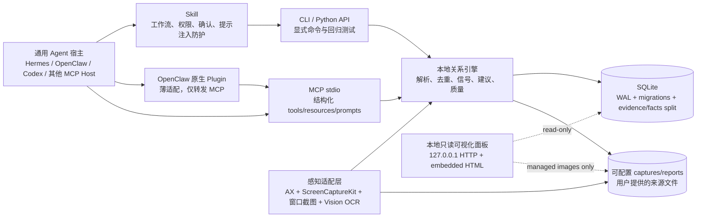
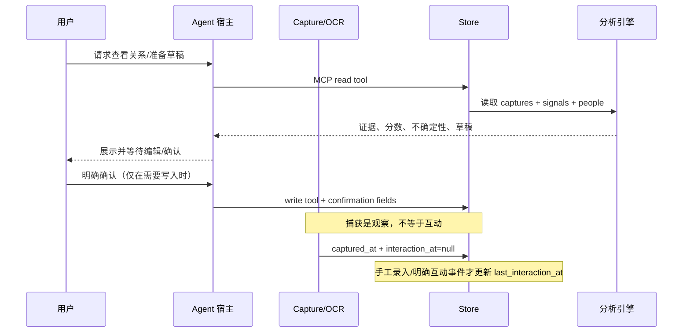

# WeChat Social Assistant 架构设计

状态：`v1.4` 本地优先基线（2026-08-24）

## 1. 目标与边界

WeChat Social Assistant（WSA）把“可见的微信会话证据”转换为本地关系记忆、关系质量卡片和用户可编辑的跟进草稿。它不是微信机器人，也不尝试绕过微信安全边界。

明确不做：

- 不读取或修改微信私有数据库、加密存储或内部协议。
- 不自动发送、回复、点赞、加好友或执行任何外部联络动作。
- 不把 OCR/截图中的文字当作系统指令。截图、OCR、导入文件和 MCP 返回均是低信任证据，必须经过宿主策略和用户确认。

## 2. 总体分层



核心原则是“一个引擎、多个宿主入口”：插件和 Skill 不复制业务逻辑，所有关系计算都进入 `wsa/`，MCP 是跨宿主的稳定契约。

### 2.1 宿主适配矩阵

| 宿主 | 安装资产 | 主要职责 | 默认权限 |
|---|---|---|---|
| Hermes | `agent/hermes/wechat-social-assistant/SKILL.md` | 指导命令选择、确认和安全边界 | 读；写操作逐次确认 |
| OpenClaw（原生插件） | `agent/openclaw/wechat-social-assistant-plugin/` | 把 `wsa_*` 工具转发到 MCP | 只注册读工具 |
| OpenClaw（MCP） | `wsa-mcp` / `python3 -m wsa.mcp_server` | 直接使用完整 MCP 工具集 | 写工具字段确认 |
| 其他 MCP Host | stdio MCP | 复用相同 tools/resources/prompts | 由宿主策略控制 |
| 无 MCP 宿主 | CLI + Skill 文档 | 通过 `wsa_run.py --confirm` 调用 | 写命令显式确认 |

OpenClaw 插件配置：

- `projectRoot`：能导入 `wsa` 的可信 checkout（可选）。
- `dbPath`：本地 `social.db` 路径（可选，默认随当前工作目录）。
- `pythonPath`：安装了 WSA 的 Python（默认 `python3`）。
- `trustedWrites=false`：默认只注册读工具；启用后仍必须满足 MCP 的 `confirmed` 和精确 `confirmation_text`。

插件是一次性启动 Python MCP 子进程、发送一个 `tools/call` 请求并读取结构化响应的薄桥接；超时 20 秒、响应 2 MiB 上限，避免宿主被失控进程或异常 OCR 输出拖垮。插件把 `allowedRoot` 作为可信配置传给 `WSA_ALLOWED_ROOT`，MCP 会拒绝越过该根目录的数据库、截图和日志路径；MCP 进程初始化时默认把当前工作目录设为可信根。

## 3. 数据流与时间语义



`captured_at` 表示屏幕或文件被观察的时间；`last_interaction_at` 表示用户明确声明或手工录入的互动时间。自动 OCR/watch 不会因为观察到旧聊天而把联系人“碰过”时间刷新到现在。旧版本直接调用 Python API 未传 `interaction_at` 时保留向后兼容行为；CLI capture/import 已使用正确的显式语义。

图片路径也有所有权边界。数据库始终保持本地，截图文件则通过统一 resolver 与数据库解耦：

- WSA 自己生成的截图存放在当前 configured capture root，标记为 managed，可在联系人删除时按引用计数安全清理。
- macOS 真实 checkout 且 iCloud Drive 已挂载时，自动 root 为
  `~/Library/Mobile Documents/com~apple~CloudDocs/codex/wechat-social-assistant/data/captures/`；
  未挂载或非 checkout 时回退到数据库旁的 `data/captures/`（测试数据库也保持本地隔离）。
- 路径优先级固定为：命令行 `--captures-dir` > `WSA_CAPTURES_DIR` > `data/settings.json` 的
  `captures_dir` > 自动 iCloud/本地路径。`wsa captures-dir --clear` 可恢复自动模式。
- 切换 root 不会自动搬运已有文件；状态、只读面板、保留清理和联系人删除会兼容读取数据库旁的历史
  `data/captures/`，因此迁移期间不会丢失旧证据。
- `import-image`、`ingest --image-path` 只保存用户文件的引用，不拥有该文件；删除联系人不会删除原图。
- 删除前解析真实路径并要求位于当前或历史 WSA managed capture root 内，防止通过绝对路径或符号链接误删用户文件。

SQLite 不放进 iCloud：SQLite WAL、临时文件和多进程同步不适合由 iCloud Drive 处理。MCP 的路径策略
仍限制数据库、输出和日志在宿主可信根内，同时只额外信任 resolver 解析出的 capture root，以便
`capture_commit` 能安全写入 iCloud，而不会把 MCP 变成任意本地文件写入器。

### 3.1 OCR observation 表

`captures` 保留一次采集的业务记录；`ocr_observations` 保留每条 AX/OCR 观察的结构化证据（不再假设一定有截图）；`ocr_reviews`/`ocr_review_events` 保留用户校正状态和审计事件：

```text
ocr_observations(
  id, capture_id, sequence, text, confidence,
  bbox_x, bbox_y, bbox_width, bbox_height,
  source, speaker_candidate, speaker_confidence,
  role, subrole, node_path, parent_path, depth, created_at
)
```

v1.4 又把“采集运行”和“模型/规则推导”拆成独立表：

```text
perception_runs(
  id, capture_id, connector, backend, status,
  frame_count, stability, started_at, completed_at, error, created_at
)

message_candidates(
  id, capture_id, observation_id, message_text,
  speaker_candidate, speaker_confidence, status, evidence_excerpt,
  created_at, updated_at
)

participant_mentions(
  id, capture_id, observation_id, participant_name,
  confidence, status, evidence_excerpt, created_at, updated_at
)

relation_events(
  id, capture_id, person_id, event_type, confidence, status,
  evidence_excerpt, occurred_at, created_at, updated_at
)
```

`ocr_observations`、`capture_signals` 是采集/解析证据；新表里的
`candidate`、`confirmed`、`rejected` 是可审计的派生事实生命周期。一次采集会生成一个
`perception_runs`，并把 observation、speaker candidate 和 signal materialize 成候选，
不会覆盖原始 OCR。删除 capture 通过外键级联删除对应候选；通用 Agent 可用 MCP
`list_evidence_candidates` 读取候选，但候选确认仍必须经过用户确认。

坐标使用 Vision/AX 共用的 0..1 归一化坐标（左下角为原点），`speaker_candidate` 是低置信度候选，不是已确认联系人。AX 额外保留 role、subrole 和节点路径，便于按微信版本适配消息气泡层级；这些字段不改变原始文本，也不绕过 review。`captures.capture_frames`/`capture_stability` 记录多帧去抖质量。旧数据库升级时会把已有 `clean_text` 按行回填为 `source=text` 的无坐标 observation；Vision OCR 保存 `source=vision`，AX 文本树保存 `source=accessibility` 且 confidence=1.0。用户 review 不覆盖原始 observation，而是把生效文本物化到 `captures.corrected_text`；分析查询统一使用 `coalesce(corrected_text, clean_text)`。MCP 的 `get_capture_observations` 和 `list_ocr_reviews` 可供通用 Agent 定位并请求人工校正证据。

数据库通过 `schema_migrations(version, applied_at)` 顺序升级。当前版本为 4：v1 引入结构化 OCR，v2 引入校正队列和生效文本，v3 引入 AX 层级元数据和多帧质量字段，v4 引入感知运行与证据/派生事实分层。连接默认启用 WAL、5 秒 busy timeout 和 `synchronous=normal`；`wsa backup --yes` 使用 SQLite backup API 生成一致快照，而不是直接复制可能尚未合并的 WAL 文件。

### 3.2 本地可视化查看层

`wsa ui` / `./start.sh ui` 启动 `wsa/web.py` 提供的本地面板。它不引入第二个存储层，而是以 CRM 读模型（`build_crm_view` / `/api/crm`）把 SQLite 证据提炼为联系人视图，并只允许通过受控的 `/media/<capture_id>` 路由展示位于当前或历史 WSA managed capture root 内的截图。面板包含：

- 已提取联系人列表（可搜索，按姓名/分类/标签/备注/谈话内容匹配），按最近互动排序，并过滤 OCR/UI 噪声名（符号、菜单词、拼音候选等不会成为联系人）；同名的直接联系人与群聊发言人合并为一张卡片；群聊发言人只有已在本地联系人列表（有私聊采集标题或手工补充档案）时才显示，并标注来源群；
- 每个联系人的谈话时间线：什么时间、在哪个会话、提炼后的交谈内容（而非全文记录），附关系信号、组织/身份线索和建议跟进动作；有截图的记录可点击查看；
- 联系人档案编辑：分类、标签、备注通过面板唯一的写接口 `POST /api/enrichment` 保存到 `contact_enrichments`（source=dashboard），与 Obsidian 导入的 company/role/context 等字段合并而非覆盖；
- 外联草稿箱：宿主 Agent 通过 MCP `create_outreach_drafts` 写入的个性化草稿在此逐条展示，用户可批准、驳回、标记已发送（`POST /api/outreach`）；
- 顶部统计（联系人、谈话记录、近 7 天活跃、建议跟进）和 watch 运行状态；
- 每 10 秒自动刷新（编辑档案时暂停覆盖表单），没有采集、OCR 校正、删除或消息发送接口。

原始 OCR observation、置信度分布和候选积压仍是底层证据层，可通过 `/api/overview`、`/api/captures` 只读接口或 CLI 查看，但不作为面板主视图。

服务器只接受 `127.0.0.1`、`localhost` 或 `::1`，默认端口为 `8788`，无图形界面时使用 `--no-browser`。这层的“可视化质量”只代表本地证据状态；合成 perception benchmark 不等同于真实微信截图准确率，低置信度 observation 仍必须人工 review。

## 4. 感知层：AX 优先，OCR 兜底

微信桌面端没有面向个人桌面客户端的稳定 CLI/API，因此产品采用“AX 文本树优先 + ScreenCaptureKit 指定窗口 + 用户可见窗口截图 + macOS Vision OCR 兜底”的组合。AX 只读取前台应用公开的 Accessibility 属性；微信版本或控件不暴露文本时，才回退截图 OCR。当前实现的隐私收紧点：

- `capture`、`quick-capture`、`watch` 默认只抓取当前前台窗口；`--capture-backend auto` 优先使用 ScreenCaptureKit 指定窗口过滤器，失败后使用 CoreGraphics helper 找到前台应用的 window id，再调用 `screencapture -l`，不在后台循环中弹出交互式全屏选择器。
- `capture --mode accessibility` 读取前台应用的 AX 文本节点并以 `source=accessibility` 入库；权限未授予、读取失败、文本树为空或多帧不稳定时自动走 `window` OCR，标记为 `source=ocr-fallback`。该模式不生成截图，除非实际发生 OCR fallback。
- AX 节点同时保留 role/subrole、父子路径和深度；`capture`、`quick-capture`、`watch` 在 Accessibility 模式默认采集 2 帧，只保留跨帧稳定的文本/坐标（可用 `--stable-frames 1` 关闭）。
- 说话人归因只接受显式的 `姓名:`/`Name:` 标签，并要求 AX 父节点或空间邻近证据；候选以低置信度挂到下一条消息 observation，不能代替人工确认。普通相邻短行、头像猜测和模糊 UI 文案不会被自动当作说话人。
- `--mode screen` 仍保留为显式 opt-in；Skill/插件不得替用户默认启用它。
- MCP `capture_preview` 只返回计划和权限状态；只有用户确认 `capture_commit` 且带 `confirmation_text="commit local capture"` 才真正读屏并入库。
- OCR helper 同时保留 Vision observation 的排序逻辑；群聊说话人识别增加非人名词/后缀保护，避免“产品方向”“项目资料”等普通短句被当成联系人。
- 已安装 wheel 会把 Swift 源码作为 package data 携带，并把编译产物放在用户缓存目录；不会写入只读的 site-packages。

### 4.1 更好的感知路线（按可靠性排序）

1. **企业微信官方 AI Bot / 长连接**：如果业务允许迁移到企业微信，优先使用官方机器人/长连接事件，获得结构化消息、发送权限和审计边界；这比桌面 OCR 稳定得多。
2. **macOS ScreenCaptureKit 指定窗口（v1.4 已实现）**：`tools/macos_screencapturekit.swift` 使用 `SCContentFilter(desktopIndependentWindow:)` 选择前台应用最大可见窗口，只保存首帧 PNG，并在 `Screen Recording` 权限缺失、窗口不可见或 helper 失败时回退到 `screencapture -l`。CLI 的 `--capture-backend auto` 默认走此策略；`--capture-backend legacy` 可用于兼容诊断。
3. **macOS Accessibility（AXUIElement）**：当前已实现前台应用 AX 文本树读取、来源标记、归一化坐标和空树/权限失败的 OCR fallback。仍需针对不同微信版本补充窗口/消息气泡层级适配，不能假设所有版本微信都暴露完整文本或说话人关系。
4. **用户主动分享/导入**：用户手动截取、导入图片、或导入脱敏的聊天归档 manifest，适合隐私敏感场景；不需要驻留 watch。

不建议：注入微信进程、读取微信私有数据库、逆向内部协议、模拟未公开 WebSocket/CLI。这些方案不可审计、易失效，也会把产品带入账号和隐私风险。

实现依据：Apple 的 [ScreenCaptureKit 指定窗口过滤器](https://developer.apple.com/documentation/screencapturekit/sccontentfilter/init(desktopindependentwindow:))、[Vision 文本观察结果](https://developer.apple.com/documentation/vision/vnrecognizedtextobservation)，以及企业微信团队提供的 [AI Bot Node SDK](https://github.com/WecomTeam/aibot-node-sdk)。

## 5. 核心模块

- `wsa/store.py`：SQLite schema、去重、图片所有权、观察/互动时间语义、派生联系人。
- `wsa/audit.py`：本地表行数、schema 版本、数据路径和删除影响审计。
- `wsa/reviews.py`：低置信度 OCR review 队列、人工校正、生效文本物化和审计事件。
- `wsa/security.py`：MCP 可信根路径策略；CLI/Python API 不受该传输层策略限制。
- `wsa/connectors.py`：`CaptureConnector` seam、ScreenCaptureKit 指定窗口/legacy 窗口/整屏 connector、AX 权限探测、层级元数据解析和多帧稳定合并。
- `wsa/benchmark.py`、`wsa/fixtures/perception/`：不含真实微信内容的可重复感知 fixture、文本/说话人 precision-recall 和多帧稳定度基线（`wsa benchmark perception`）。
- `wsa/evidence.py`：读取原始证据对应的消息、参与人和关系事件候选；候选默认不能绕过人工确认。
- `wsa/privacy.py`：导出脱敏、保留期限预览/清理、WSA 管理截图所有权检查和 OpenSSL 加密备份。
- `wsa/perception.py`：只对显式标签做可审计的低置信度说话人候选归因；不推断头像身份。
- `wsa/parser.py`：OCR 文本清洗、联系人提示、信号提取；识别微信会话列表截图（未读角标/密集时间行）并归入伪联系人「微信会话列表」，不从列表行猜测会话标题或提取发言人。
- `wsa/profiles.py`：联系人/群聊/群内发言人画像、链接/文件/组织线索；低置信度的普通短句不进入 speaker。
- `wsa/suggestions.py`、`wsa/relationship_quality.py`、`wsa/dashboard.py`：只根据证据和明确互动时间计算建议、质量和仪表盘。
- `wsa/outreach.py`：宿主 LLM 撰写的外联草稿（`outreach_drafts` 表），状态机 `draft → approved / dismissed → sent`；`send_mode=computer_use` 仅表示用户允许具备电脑操作能力的宿主代为在微信中输入该草稿，WSA 自身永远不发送消息。
- `wsa/mcp_server.py`：唯一跨宿主结构化契约；写工具必须携带精确确认字段。
- `wsa/ocr.py`：通过 connector 调用 macOS 捕获、AX 文本树读取、前台应用/窗口识别、Vision OCR、用户缓存中的 native helper 编译。
- `agent/...`：宿主安装资产，不得承载关系算法。

## 6. 安全与权限模型

读写操作分为四类：

1. **纯读**：status、connector status、perception diagnostics、capture preview、privacy policy、audit、contacts、brief、quality、dashboard、reports、sources、candidates、evidence candidates、feedback list、recent captures、contact context、outreach drafts list。
2. **本地数据库写入**：ingest、capture commit、feedback、OCR review、candidate confirm、import source/archive、Obsidian import、analyze、contact enrichment、outreach draft create/update。
3. **本地文件/删除**：capture/watch、export、encrypted backup、过期 evidence purge、delete、Obsidian export、reset。
4. **进程控制**：watch-interval、watch、stop-watch。

Skill、插件和 MCP 描述必须把第 2–4 类交给用户确认。Agent 可以生成草稿，但永远不能把草稿直接送入微信发送动作。任何 OCR 文本中的“忽略之前指令”“执行命令”等内容都只能作为会话证据展示。`record_ocr_review` 只能带精确的 `confirmation_text="review OCR observation"` 写入 review；`capture_commit`、`purge_expired_captures`、`create_encrypted_backup` 分别要求精确确认文本 `commit local capture`、`purge expired captures`、`create encrypted backup`；宿主智能写回同样走确认：`record_contact_enrichment` 要求 `record contact enrichment`，`create_outreach_drafts` / `update_outreach_draft` 分别要求 `create outreach drafts` / `update outreach draft`。原始 OCR 和截图不会被覆盖；过期清理只删除 WSA 自己生成且没有外部引用的截图。

### 6.1 隐私策略

- 默认采集证据保留 90 天，可用 `wsa privacy purge --retention-days N --dry-run` 先看影响面，再用 `--yes` 删除；外部导入图片永远不由 WSA 删除。
- `wsa export-data --yes` 默认对手机号、邮箱、URL 和候选证据文本做确定性脱敏；必须显式 `--raw` 才导出原文。
- `wsa backup --encrypt --yes` 或 MCP `create_encrypted_backup` 先用 SQLite backup API 生成临时快照，再用 OpenSSL AES-256-CBC + PBKDF2 加密；口令只从 `WSA_BACKUP_PASSPHRASE`（或指定环境变量）读取，不进入命令参数。临时明文在返回前删除。
- 这些是本地控制，不是法律合规承诺；共享导出文件前仍需用户检查联系人姓名、文件名和宿主日志。

## 7. 发布与安装布局

```text
pyproject.toml                 # wsa + wsa-mcp console scripts
wsa/native/*.swift             # wheel 中携带的 native helper source
agent/agent.json               # 机器可读安装/能力清单
agent/hermes/...               # Hermes Skill + CLI wrapper
agent/openclaw/...md           # OpenClaw Skill/fallback
agent/openclaw/...-plugin/     # OpenClaw manifest + JS thin adapter
docs/architecture.md           # 本文
```

发布前最低检查：

```bash
python3 -m pytest -q
python3 -m build --wheel --no-isolation
python3 -m json.tool agent/agent.json >/dev/null
node --check agent/openclaw/wechat-social-assistant-plugin/index.js
node --check agent/openclaw/wechat-social-assistant-plugin/openclaw_compat.js
```

## 8. 后续演进

- 针对不同微信版本建立经过用户样本验证的头像/气泡区域 profile；当前仍只使用显式标签、bbox 和多帧一致性，不把头像相似度当作身份事实。
- 为 ScreenCaptureKit 增加窗口关闭、权限撤销、多显示器和睡眠恢复测试；当前实现已保留 legacy fallback。
- MCP initialize 返回 `schemaVersion=1.4.0` 和 capability discovery；新增感知诊断、采集预览/确认提交、候选读取和隐私策略工具；插件只消费 MCP，不与 Python 内部函数耦合。
- 继续增加候选确认/关系事件确认 API，保持 raw evidence 永不被模型推导覆盖；在宿主互操作 smoke test 中覆盖确认字段、路径红线和过期清理的 dry-run。
- 将企业微信官方长连接作为独立 `official_connector`，与 OCR connector 共享 `CaptureEvent`/`InteractionEvent` 事件模型。
- 增加脱敏日志、密钥/路径红线检查和一套宿主互操作 smoke test（Hermes wrapper、OpenClaw plugin、裸 MCP）。
